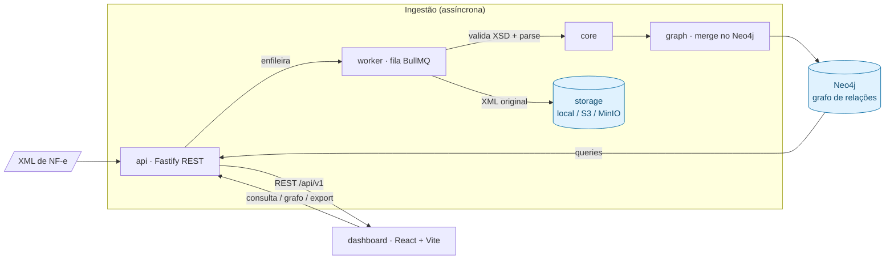

<div align="center">


<p>
  <a href="https://www.npmjs.com/package/@notagrafo/core"></a>
  <a href="https://www.npmjs.com/package/@notagrafo/core"></a>
  <a href="https://github.com/felipesauer/notagrafo/pkgs/container/notagrafo-api"></a>
  <a href="https://github.com/felipesauer/notagrafo/actions/workflows/ci.yml"></a>
</p>

<p>
  <a href="LICENSE"></a>
  
  
  
  
  
  
  
  
</p>

<p>
Sistema open-source de processamento e análise de <strong>Notas Fiscais Eletrônicas (NF-e)</strong>.<br />
Recebe XMLs de NF-e, valida contra os XSDs oficiais da SEFAZ, processa via filas,<br />
persiste os dados como um <strong>grafo de relacionamentos</strong> no Neo4j e expõe tudo<br />
por uma API REST e um dashboard interativo com visualização de grafo.
</p>

<p>
<strong>Objetivo:</strong> rastrear relações entre empresas, produtos, CFOPs e NCMs de<br />
forma visual e consultável — padrões, ligações comuns e caminhos entre<br />
emitentes e destinatários.
</p>

<sub>Documento suportado: <strong>NF-e v4.00</strong> · Licença <strong>MIT</strong></sub>

</div>

---

## 📦 Disponível no npm e Docker

O notagrafo é publicado em dois formatos, prontos para uso:

- **Bibliotecas no npm** — instale os pacotes da org [`@notagrafo`](https://www.npmjs.com/org/notagrafo) e use o parser/validador de NF-e, a camada de grafo ou o worker no seu próprio projeto:

  ```bash
  pnpm add @notagrafo/core        # tipos, parser e validador XSD da NF-e v4.00
  ```

- **Imagens Docker no GHCR** — rode a aplicação completa (API, worker e dashboard) sem buildar nada:

  ```bash
  docker pull ghcr.io/felipesauer/notagrafo-api:latest
  ```

Detalhes em [Pacotes npm](#pacotes-npm) e [Imagens Docker (GHCR)](#imagens-docker-ghcr).

---

## O que o notagrafo faz

Você joga um XML de NF-e (ou um lote em ZIP) e o notagrafo cuida do resto: valida
contra o XSD oficial da SEFAZ, processa em fila, modela tudo como um **grafo de
relacionamentos** e abre um **dashboard de BI** para explorar os dados.

### Ingestão e processamento
- **Upload de NF-e** (XML avulso ou ZIP em lote) com validação contra o **XSD oficial v4.00**.
- **Processamento assíncrono** via filas (BullMQ/Redis) com retry e DLQ — o upload responde na hora e o processamento acontece em background.
- **Storage do XML original** configurável (`local` / `S3` / `MinIO`).
- **Deduplicação** por chave de acesso — reenviar a mesma nota não duplica dados.

### Modelo em grafo (Neo4j)
- Modela `Empresa`, `NotaFiscal`, `Produto`, `NCM`, `CFOP` como **nós**, ligados por `EMITIU`, `DESTINADA_A`, `CONTÉM` (com tributos por item), `CLASSIFICADO_EM`, `USA_CFOP` e `DEVOLVE`.
- Permite responder perguntas que uma tabela não responde: *quem são os parceiros comerciais desta empresa? que caminho liga emitente e destinatário? quais produtos circulam entre elas?*

### Dashboard (React + Vite)
- **Visão geral** de BI: KPIs, volume/valor por período, composição tributária, top fornecedores e distribuição por UF.
- **Explorador** unificado de NF-e, Empresas, Produtos e Impostos — com busca, filtros avançados, ordenação, paginação e *peek* lateral (prévia sem sair da lista).
- **Grafo de relações** interativo (WebGL): busca por CNPJ, profundidade ajustável, destaque de caminho entre duas empresas, inclusão de produtos/notas.
- **Rede** (fluxo de valor em Sankey + rede comercial completa) e **linha do tempo de eventos**.
- **Exportação** assíncrona (CSV / XLSX / JSON) com **~19 campos selecionáveis** agrupados.
- **Conta e perfil**: cadastro, login (JWT) e edição de nome/e-mail/senha.
- Bilíngue (**pt-BR / en**), tema claro/escuro e densidade de tabela ajustável.

### Plataforma
- **API REST** documentada (OpenAPI/Swagger em `/docs`), com rate limit e observabilidade (métricas Prometheus + OpenTelemetry).
- **LGPD**: pseudonimização opcional de CPF de MEI nos logs e na UI.
- **Monorepo** testado ponta a ponta: unitários (Vitest), integração (Testcontainers com Neo4j/Redis/MinIO reais) e e2e (Playwright).

---

## Sumário

- [O que o notagrafo faz](#o-que-o-notagrafo-faz)
- [Stack](#stack)
- [Pacotes npm](#pacotes-npm)
- [Imagens Docker (GHCR)](#imagens-docker-ghcr)
- [Quickstart (5 minutos)](#quickstart-5-minutos)
- [Portas e serviços](#portas-e-serviços)
- [Desenvolvimento](#desenvolvimento)
- [Autenticação](#autenticação)
- [Variáveis de ambiente](#variáveis-de-ambiente)
- [Scripts](#scripts)
- [Arquitetura](#arquitetura)
- [Exportações](#exportações)
- [Como contribuir](#como-contribuir)
- [Licença](#licença)

---

## Stack

| Camada | Tecnologia |
|---|---|
| Monorepo | pnpm workspaces (`@notagrafo/{core,graph,api,worker,dashboard}`) |
| Backend | Node.js 20 + Fastify + TypeScript |
| Fila | BullMQ + Redis 7 |
| Grafo | Neo4j 5 |
| Storage de XML | Configurável: `local` / `s3` / `minio` (padrão: MinIO) |
| Validação / parse | XSD oficial via `libxmljs2` / `fast-xml-parser` |
| Auth | JWT manual (`@fastify/jwt`) |
| Dashboard | React + Vite + TanStack Router/Query, Recharts, React Flow + dagre |
| Testes | Vitest + Testcontainers + Playwright |
| Infra | Docker Compose (profiles) + GitHub Actions |

---

## Pacotes npm

As bibliotecas reutilizáveis são publicadas na org [`@notagrafo`](https://www.npmjs.com/org/notagrafo):

| Pacote | Descrição |
|---|---|
| [`@notagrafo/core`](https://www.npmjs.com/package/@notagrafo/core) | Tipos da NFe v4.00, parser, validador XSD e catálogos fiscais (NCM/CFOP). |
| [`@notagrafo/graph`](https://www.npmjs.com/package/@notagrafo/graph) | Camada Neo4j: schema, repositórios e queries Cypher sobre os dados de NFe. |
| [`@notagrafo/worker`](https://www.npmjs.com/package/@notagrafo/worker) | Processadores BullMQ, storage de XML (local/S3) e utilitários de seed. |
| [`@notagrafo/api`](https://www.npmjs.com/package/@notagrafo/api) | App Fastify: upload, consulta, exportação e auth sobre o grafo. |

> O `@notagrafo/dashboard` é uma SPA e **não** é publicado no npm — use a imagem Docker.

```bash
pnpm add @notagrafo/core
```

```ts
import { validateNFe } from '@notagrafo/core';

const result = validateNFe(xmlString); // valida contra o XSD oficial da NFe v4.00
```

Os pacotes são publicados com [provenance](https://docs.npmjs.com/generating-provenance-statements)
(supply-chain attestation via OIDC).

---

## Imagens Docker (GHCR)

As aplicações são publicadas como imagens no GitHub Container Registry a cada release:

| Imagem | Conteúdo |
|---|---|
| `ghcr.io/felipesauer/notagrafo-api` | API Fastify (produção) |
| `ghcr.io/felipesauer/notagrafo-worker` | Worker BullMQ (produção) |
| `ghcr.io/felipesauer/notagrafo-dashboard` | Dashboard servido via nginx |

Cada imagem recebe as tags `latest`, o short SHA do commit e um timestamp.

```bash
docker pull ghcr.io/felipesauer/notagrafo-api:latest
```

Para subir a stack a partir das imagens do registry (em vez de buildar localmente),
aponte o Compose para elas via variáveis de imagem — veja
[Comandos e modos de execução](#comandos-e-modos-de-execução).

---

## Quickstart (5 minutos)

A forma mais rápida de ver o sistema funcionando, com dados de demonstração.
Único pré-requisito: **Docker** e **Docker Compose**.

```bash
# 1. Clone
git clone https://github.com/felipesauer/notagrafo.git
cd notagrafo

# 2. Configure o ambiente (o Compose lê o .env)
cp .env.example .env
# os defaults já servem para rodar localmente; troque as senhas em produção

# 3. Suba tudo com dados de demonstração
pnpm demo        # = docker compose --profile app --profile demo up --build
```

Quando os serviços ficarem *healthy*, acesse:

| Serviço | URL |
|---|---|
| **Dashboard** | http://localhost:8080 |
| **API (Swagger)** | http://localhost:3000/docs |
| **Neo4j Browser** | http://localhost:7474 |
| **MinIO Console** | http://localhost:9001 |

O profile `demo` gera NF-es fictícias, popula o grafo e cria um usuário de login
(ver [Autenticação](#autenticação)). Abra o **dashboard → Grafo**, busque uma
empresa e navegue pelos relacionamentos.

> **Porta do Redis em uso?** O host usa `6379` por padrão. Se já houver um Redis
> local nessa porta, suba com outra: `REDIS_PORT=16379 docker compose --profile app up`.

---

## Portas e serviços

Portas expostas no host com `docker compose --profile app --profile demo` (defaults
do [`.env.example`](.env.example); `REDIS_PORT` é configurável):

| Serviço | Host | Container | Observação |
|---|---|---|---|
| dashboard | `8080` | `80` | nginx servindo o build (apenas no modo Docker) |
| api | `3000` | `3000` | REST + Swagger em `/docs` |
| neo4j | `7474`, `7687` | `7474`, `7687` | HTTP (browser) e Bolt |
| redis | `6379` | `6379` | `REDIS_PORT` no host; `redis:6379` na rede interna |
| minio | `9000`, `9001` | `9000`, `9001` | API S3 e console |
| mailpit | `8025`, `1025` | `8025`, `1025` | captura de e-mail em dev (UI em `8025`) |

> No modo de **desenvolvimento** (`pnpm dev`) o dashboard **não** usa a `8080` —
> ele roda pelo Vite em **http://localhost:5173**. Veja abaixo.

---

## Comandos e modos de execução

Há três modos, cada um com um comando dedicado. Todos param com `pnpm down`.

| Comando | O que sobe | Quando usar |
|---|---|---|
| `pnpm dev` | infra no Docker + **app no host** (hot-reload) | dia a dia de desenvolvimento |
| `pnpm stack` | **app inteiro** containerizado (build das imagens) | validar a stack como em produção (E2E) |
| `pnpm demo` | stack + seed de demonstração | ver o sistema pronto com dados |
| `pnpm infra` | só infra (Neo4j, Redis, MinIO, Mailpit) | rodar serviços manualmente |
| `pnpm down` | **para tudo** (app + infra) e libera as portas | ao terminar |

> O worker sobe com **1 réplica** por padrão (subida rápida). Para escalar em
> produção, use `WORKER_REPLICAS=3 pnpm stack`.

### Desenvolvimento (recomendado)

Itera no código com hot-reload, sem buildar as imagens Docker da aplicação.
Pré-requisitos: **Node.js 20+**, **pnpm** e **Docker** (para a infra).

```bash
pnpm install
pnpm dev
```

O `pnpm dev`:

1. sobe **só a infraestrutura** (Neo4j, Redis, MinIO, Mailpit) e **espera** ela
   ficar *healthy* — `pnpm infra` (= `docker compose up -d --wait`);
2. builda as libs internas (`core`, `graph`);
3. roda o seed de demonstração;
4. sobe **API**, **worker** e **dashboard** **no host** em modo watch, em paralelo.

URLs no modo dev:

| Serviço | URL |
|---|---|
| **Dashboard (Vite)** | **http://localhost:5173** |
| **API (Swagger)** | http://localhost:3000/docs |
| **Neo4j Browser** | http://localhost:7474 |

> A porta **`8080` só existe nos modos containerizados** (`pnpm stack`/`pnpm demo`),
> onde o nginx serve o build estático. Em desenvolvimento, use a **`5173`** (Vite).

### Passo a passo manual

Se quiser controlar cada etapa (em vez do `pnpm dev`):

```bash
pnpm infra                      # sobe redis, neo4j, minio, mailpit (e espera healthy)
pnpm dev:libs                   # builda core + graph
pnpm dev:seed                   # popula o grafo (opcional)
pnpm dev:packages               # api + worker + dashboard em watch
```

### Encerrando

Como `Ctrl+C` encerra só os processos locais (a infra sobe *detached*), derrube
os containers e **libere as portas** quando terminar:

```bash
pnpm down                       # para e remove TODOS os containers (libera as portas)
```

> Os containers usam `restart: "no"` — não voltam sozinhos no boot da máquina.
> As portas do host são configuráveis via `.env` (veja `.env.example`), então
> o notagrafo não atropela outras aplicações locais.

---

## Autenticação

A API usa **JWT Bearer** emitido pelo `@fastify/jwt`. O login retorna um token; as
rotas protegidas exigem `Authorization: Bearer <token>`.

No profile **demo**, o seed cria um usuário para você entrar de imediato:

| Campo | Valor padrão | Variável |
|---|---|---|
| E-mail | `demo@notagrafo.local` | `DEMO_USER_EMAIL` |
| Senha | `demo1234` | `DEMO_USER_SENHA` |

A autenticação pode ser ligada/desligada por flags — útil para explorar a API sem
login em desenvolvimento:

- `AUTH_ENABLED` (padrão `true`): liga/desliga a auth na API e no dashboard.
- `DEMO_AUTH_ENABLED` (padrão `true`): **sobrepõe** `AUTH_ENABLED` quando `DEMO=true`.
- `VITE_AUTH_ENABLED` / `VITE_DEMO_AUTH_ENABLED`: espelham as flags acima no build do
  dashboard (SPA — as flags são resolvidas em *build-time*, então precisam estar
  presentes ao buildar).

> ⚠️ **Nunca rode em produção com a auth desligada.** `AUTH_ENABLED=false` (ou
> `DEMO_AUTH_ENABLED=false`) é um kill-switch **global**: todas as rotas protegidas
> ficam abertas — qualquer um lê, envia e exporta NF-e sem token. É só para explorar
> a API localmente. Se a API subir com `NODE_ENV=production` **e** a auth desligada,
> ela imprime um banner de aviso destacado (nível error) no boot.

---

## Variáveis de ambiente

A referência completa, comentada, está em [`.env.example`](.env.example) — copie
para `.env` e ajuste. As principais:

| Variável | Padrão | Descrição |
|---|---|---|
| `DEMO` / `DEMO_NF_COUNT` | `false` / `500` | Seed de NF-es fictícias no boot |
| `NEO4J_URI` / `NEO4J_USER` / `NEO4J_PASSWORD` | `bolt://localhost:7687` / `neo4j` / `changeme` | Conexão Neo4j |
| `REDIS_URL` / `REDIS_PORT` | `redis://localhost:6379` / `6379` | Fila BullMQ; `REDIS_PORT` é a porta no host |
| `WORKER_CONCURRENCY` / `JOB_MAX_RETRIES` / `JOB_BACKOFF_DELAY` | `4` / `3` / `5000` | Processamento do worker |
| `MAX_XML_BYTES` | `5242880` (5 MiB) | Teto de tamanho de um XML de NF-e no enqueue; acima → `413` |
| `XML_STORAGE_DRIVER` | `minio` | `local` \| `s3` \| `minio` |
| `PORT` / `NODE_ENV` | `3000` / `development` | API |
| `RATE_LIMIT_MAX` / `RATE_LIMIT_WINDOW` | `100` / `60000` | Rate limit da API (req. por janela / janela em ms) |
| `AUTH_ENABLED` / `DEMO_AUTH_ENABLED` | `true` / `true` | Liga/desliga a auth (ver [Autenticação](#autenticação)) |
| `AUTH_SECRET` / `AUTH_JWT_EXPIRES_IN` | — / `7d` | Assinatura e validade do JWT |
| `EXPORT_TTL_HOURS` | `24` | Validade do arquivo de exportação |
| `LGPD_MASK_CPF` / `VITE_LGPD_MASK_CPF` | `false` / `false` | `true` → pseudonimiza CPFs de MEI (11 díg. no campo `cnpj`) nos logs da API (Pino) e, com a flag `VITE_`, na UI do dashboard. CNPJs passam intactos |
| `OTEL_EXPORTER` / `OTEL_ENDPOINT` | `none` / — | `console` \| `otlp` \| `none` |

> SMTP / magic-link ainda **não estão habilitados** (planejados no roadmap; ver
> `.env.example`). Em desenvolvimento, o Mailpit captura os e-mails localmente.

---

## Scripts

```bash
pnpm dev                # infra (--wait) + libs + seed + api/worker/dashboard (watch)
pnpm demo               # stack completa em Docker, com dados de demo (--profile app --profile demo)
pnpm build              # builda todos os pacotes na ordem de dependência

pnpm test               # unit + integração
pnpm test:unit          # testes unitários (Vitest)
pnpm test:integration   # testes de integração (Testcontainers: Neo4j/Redis/MinIO)
pnpm test:e2e           # testes e2e do dashboard (Playwright, contra docker compose)
pnpm test:coverage      # cobertura dos testes unitários

pnpm lint               # ESLint
pnpm typecheck          # tsc --noEmit
pnpm format             # Prettier
```

> A suíte de **integração** roda serializada (sobe containers reais via
> Testcontainers). A suíte **e2e** exige a stack no ar — o jeito mais simples é
> `pnpm demo` em outro terminal.

---

## Arquitetura



| Pacote | Responsabilidade |
|---|---|
| **`@notagrafo/core`** | tipos, validador XSD, parser, catálogo NCM/CFOP, `resolveUniqueId` |
| **`@notagrafo/graph`** | driver Neo4j, migrations, `mergeInvoice`, queries (empresa, NF, produto, fiscal) |
| **`@notagrafo/worker`** | storage de XML, filas BullMQ, jobs de processamento, seed de demo |
| **`@notagrafo/api`** | Fastify (auth, nf, empresa, export, stats, health), OpenAPI, observabilidade |
| **`@notagrafo/dashboard`** | React + Vite (Overview, NFs, Empresas, Produtos, Grafo, Impostos, Exportações) |

O grafo modela `Empresa`, `NotaFiscal`, `Produto`, `NCM`, `CFOP` como nós, ligados
por `EMITIU`, `DESTINADA_A`, `CONTÉM` (com os tributos por item), `CLASSIFICADO_EM`,
`USA_CFOP` e `DEVOLVE`.

### Robustez operacional

- **Healthchecks honestos.** A API expõe `GET /health`, que checa Neo4j, Redis e o
  storage de verdade (responde `503` se algum estiver fora). O **worker** não tem
  porta HTTP: ele escreve um *heartbeat* no Redis a cada 10s (chave `worker:heartbeat`,
  TTL 30s) e o container o verifica com `node dist/healthcheck.js` — se o worker
  travar ou perder o Redis, o heartbeat expira e o container fica `unhealthy`.
- **Fila resiliente.** Jobs têm retry com backoff exponencial (`JOB_MAX_RETRIES` /
  `JOB_BACKOFF_DELAY`) e vão para uma *dead-letter queue* ao esgotarem as tentativas.
  A gravação no grafo é idempotente por chave de acesso (reenviar não duplica).
- **Teto de payload.** O upload rejeita XML acima de `MAX_XML_BYTES` (5 MiB por
  padrão) com `413`, antes de enfileirar — o payload do job não cresce sem limite.

---

## Exportações

A exportação de NF-es (`POST /api/v1/export`) é **assíncrona**: cria um job, gera o
arquivo (CSV / JSON / XLSX) em background e o disponibiliza via
`GET /api/v1/export/:id/download` até o TTL (`EXPORT_TTL_HOURS`, padrão 24h).

Os **metadados** do job são persistidos no Redis quando disponível, então
**sobrevivem a um restart da API**. O **arquivo** gerado fica em disco local do nó
(por instância) — adequado a uma implantação single-node; um cenário multi-réplica
usaria um storage de arquivos compartilhado (S3/MinIO), já suportado para os XMLs.

---

## Como contribuir

Contribuições são bem-vindas! Veja o [CONTRIBUTING.md](CONTRIBUTING.md) para setup,
testes, padrão de commits (Conventional Commits) e fluxo de Pull Request.

---

## Licença

[MIT](LICENSE) © Felipe Sauer
